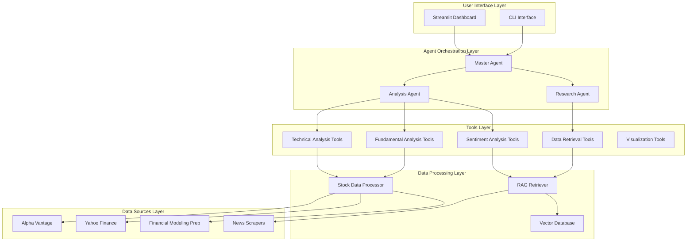

# Financial Analysis System Architecture

## Overview

This document outlines the comprehensive architecture for a multi-perspective financial analysis system using LangChain agents, built on top of the existing robust data infrastructure.

## System Architecture



## Agent Architecture Design

### 1. Master Agent (Orchestrator)
**Role**: Query coordination, workflow management, and response synthesis

**Capabilities**:
- Parse user queries and determine analysis requirements
- Coordinate Research and Analysis agents
- Synthesize comprehensive analysis results
- Generate executive summaries and recommendations
- Handle user interaction and clarifications

**POML Template**:
```xml
<poml>
  <role>You are a Master Financial Analyst coordinating comprehensive stock analysis.</role>
  <task>Coordinate research and analysis workflow to answer: {user_query}</task>
  <context>
    - Available agents: Research Agent, Analysis Agent
    - Company symbol: {symbol}
    - Analysis scope: {analysis_scope}
    - User context: {user_context}
  </context>
  <workflow>
    1. Direct Research Agent to gather relevant data
    2. Pass research results to Analysis Agent
    3. Synthesize final response with recommendations
    4. Ensure completeness and accuracy
  </workflow>
  <output-format>
    Executive Summary with:
    - Key findings synthesis
    - Investment thesis
    - Risk assessment
    - Clear recommendations
    - Confidence levels
  </output-format>
</poml>
```

### 2. Research Agent
**Role**: Data gathering, context retrieval, and information synthesis

**Capabilities**:
- Company data lookup and validation
- Historical data retrieval and preprocessing
- News and sentiment data collection
- Industry and peer analysis preparation
- RAG-based contextual information retrieval

**Tools**:
- Company overview retrieval
- Historical price and volume data
- Financial statements and metrics
- Recent news and analyst reports
- Industry comparison data
- Vector database queries

**POML Template**:
```xml
<poml>
  <role>You are a Financial Research Specialist expert in data gathering and context preparation.</role>
  <task>Gather comprehensive data and context for {symbol} analysis.</task>
  <context>
    - Target company: {symbol}
    - Research scope: {research_scope}
    - Time horizon: {timeframe}
    - Specific data needs: {data_requirements}
  </context>
  <research-checklist>
    - Company profile and business model
    - Current financial metrics and ratios
    - Historical performance data
    - Recent news and developments
    - Industry context and peer comparison
    - Market sentiment indicators
  </research-checklist>
  <output-format>
    Structured research package:
    {
      "company_profile": {...},
      "financial_data": {...},
      "market_data": {...},
      "news_sentiment": {...},
      "industry_context": {...},
      "data_quality_notes": [...]
    }
  </output-format>
</poml>
```

### 3. Analysis Agent
**Role**: Comprehensive financial analysis and insights generation

**Capabilities**:
- Multi-perspective financial analysis (technical, fundamental, sentiment)
- Risk assessment and scenario modeling
- Valuation analysis and price target estimation
- Investment recommendation formulation
- Comparative analysis and benchmarking

**Tools**:
- Technical analysis indicators
- Financial ratio calculations
- Valuation models (DCF, multiples)
- Sentiment scoring algorithms
- Risk metrics computation
- Performance attribution analysis

**POML Template**:
```xml
<poml>
  <role>You are a Senior Financial Analyst expert in comprehensive stock analysis.</role>
  <task>Perform detailed analysis of {symbol} using provided research data.</task>
  <context>
    - Research data package: {research_data}
    - Analysis dimensions: Technical, Fundamental, Sentiment
    - User query focus: {analysis_focus}
    - Risk tolerance context: {risk_context}
  </context>
  <analysis-framework>
    Technical Analysis:
    - Price trends and momentum
    - Key indicators (RSI, MACD, Moving Averages)
    - Support/resistance levels
    - Volume analysis
    
    Fundamental Analysis:
    - Valuation metrics (P/E, P/B, PEG)
    - Financial health indicators
    - Growth prospects and earnings quality
    - Competitive positioning
    
    Sentiment Analysis:
    - News sentiment and market perception
    - Analyst recommendations consensus
    - Market timing considerations
  </analysis-framework>
  <output-format>
    Comprehensive analysis report:
    {
      "executive_summary": "key insights",
      "technical_analysis": {...},
      "fundamental_analysis": {...},
      "sentiment_analysis": {...},
      "risk_assessment": {...},
      "investment_thesis": "detailed reasoning",
      "price_target": value,
      "recommendation": "buy/hold/sell with reasoning",
      "confidence_score": 0-100,
      "key_risks": [...],
      "catalysts": [...]
    }
  </output-format>
</poml>
```

## Tool System Architecture

### Research Agent Tools
```python
RESEARCH_TOOLS = [
    "get_company_overview",
    "fetch_historical_data",
    "retrieve_financial_statements",
    "get_analyst_estimates",
    "search_recent_news",
    "get_peer_comparison_data",
    "query_vector_database",
    "validate_data_quality"
]
```

### Analysis Agent Tools
```python
ANALYSIS_TOOLS = [
    # Technical Analysis
    "calculate_moving_averages",
    "compute_rsi",
    "analyze_macd",
    "identify_support_resistance",
    "calculate_volatility",
    
    # Fundamental Analysis
    "calculate_financial_ratios",
    "perform_dcf_analysis",
    "analyze_earnings_trends",
    "assess_financial_health",
    
    # Sentiment Analysis
    "analyze_news_sentiment",
    "aggregate_analyst_ratings",
    "calculate_sentiment_score",
    
    # Integrated Analysis
    "generate_investment_thesis",
    "calculate_risk_metrics",
    "perform_scenario_analysis"
]
```

### Master Agent Tools
```python
ORCHESTRATION_TOOLS = [
    "coordinate_research_request",
    "coordinate_analysis_request",
    "synthesize_agent_responses",
    "generate_executive_summary",
    "format_user_response"
]
```

## Data Flow Architecture

### Query Processing Flow

1. **User Input** → Streamlit interface captures query
2. **Query Parsing** → Master Agent analyzes intent and extracts entities
3. **Research Coordination** → Master Agent directs Research Agent to gather data
4. **Data Retrieval** → Research Agent uses tools to fetch comprehensive data
5. **Analysis Coordination** → Master Agent passes research to Analysis Agent
6. **Analysis Execution** → Analysis Agent performs multi-perspective analysis
7. **Result Synthesis** → Master Agent combines research and analysis results
7. **Response Formatting** → Results formatted for dashboard display
8. **Visualization** → Charts and metrics rendered in Streamlit

### Caching Strategy

```python
# Multi-level caching approach
CACHE_LEVELS = {
    "query_cache": "30 minutes",        # Query results
    "data_cache": "1 hour",            # Raw financial data
    "analysis_cache": "15 minutes",     # Analysis results
    "vector_cache": "24 hours"         # Vector database queries
}
```

## Error Handling and Fallback Mechanisms

### 1. Data Source Failures
- **Primary**: Try Alpha Vantage → **Fallback**: Yahoo Finance → **Final**: Financial Modeling Prep
- **Timeout handling**: Progressive timeout increase with circuit breaker pattern
- **Partial data scenarios**: Continue analysis with available data, flag missing components

### 2. Agent Failures
- **Agent timeout**: Graceful degradation to basic analysis
- **Tool failures**: Alternative tool routing or manual calculation fallbacks
- **LLM API failures**: Retry with exponential backoff, switch to backup model

### 3. Analysis Quality Assurance
- **Confidence scoring**: Each agent provides confidence metrics
- **Data quality checks**: Validate data integrity before analysis
- **Result validation**: Cross-check analysis results for consistency

## Integration with Existing Infrastructure

### Leveraging Current Components

1. **Data Collectors**: [`src/data/collectors/`] - Already excellent, no changes needed
2. **Data Processor**: [`src/data/processors/data_processor.py`] - Integrate as tool backend
3. **RAG Retriever**: [`src/rag/retriever.py`] - Connect to Research Agent
4. **Vector Database**: [`src/vector_db/`] - Use for context retrieval
5. **Configuration**: [`src/utils/config.py`] - Extend for agent settings

### New Components to Build

```
src/
├── agents/
│   ├── __init__.py
│   ├── master_agent.py      # Orchestration and synthesis
│   ├── research_agent.py    # Data gathering and context
│   └── analysis_agent.py    # Multi-perspective analysis
├── tools/
│   ├── __init__.py
│   ├── research_tools.py    # Data retrieval tools
│   ├── analysis_tools.py    # Analysis and calculation tools
│   ├── orchestration_tools.py # Agent coordination tools
│   └── visualization_tools.py # Chart and graph generation
├── prompts/
│   ├── __init__.py
│   ├── master_prompts.py    # Master agent POML templates
│   ├── research_prompts.py  # Research agent templates
│   └── analysis_prompts.py  # Analysis agent templates
├── dashboard/
│   ├── __init__.py
│   ├── main_app.py         # Streamlit main application
│   ├── components/
│   │   ├── query_interface.py
│   │   ├── analysis_display.py
│   │   └── visualization.py
│   └── utils/
│       ├── formatting.py
│       └── export.py
└── tests/
    ├── test_agents.py
    ├── test_tools.py
    ├── test_workflow.py
    └── test_integration.py
```

## Performance and Scalability

### Performance Optimizations
- **Concurrent agent execution**: Run multiple agents in parallel when possible
- **Smart caching**: Cache expensive calculations and data retrievals
- **Lazy loading**: Load data only when needed for specific analysis
- **Response streaming**: Stream results as they become available

### Scalability Considerations
- **Rate limiting**: Respect API limits across all data sources
- **Resource management**: Monitor memory usage for large datasets
- **Queue management**: Handle multiple concurrent user requests
- **Database optimization**: Efficient vector similarity search

## Security and Compliance

### API Key Management
- **Environment variables**: Secure storage of API keys
- **Key rotation**: Support for API key updates without restart
- **Usage monitoring**: Track API usage across all sources

### Data Privacy
- **Query logging**: Optional query logging with privacy controls
- **Data retention**: Configurable data retention policies
- **User data**: No persistent storage of user queries by default

## Testing Strategy

### Unit Testing
- **Agent testing**: Mock data responses and verify analysis logic
- **Tool testing**: Validate calculation accuracy and error handling
- **Integration testing**: End-to-end workflow testing

### Sample Test Cases
```python
SAMPLE_QUERIES = [
    "Analyze Apple's current technical and fundamental position",
    "What's the sentiment around Tesla after the latest earnings?",
    "Compare Microsoft and Google's valuation metrics",
    "Should I buy Amazon stock based on recent news?",
    "Perform a comprehensive analysis of NVIDIA"
]
```

## Deployment Configuration

### Dependencies
```python
# Additional dependencies to add to pyproject.toml
ADDITIONAL_DEPS = [
    "streamlit>=1.28.0",
    "plotly>=5.17.0",
    "altair>=5.0.0",
    "langchain-experimental>=0.3.0",
    "langchain-community>=0.3.0",
    "ta-lib>=0.4.25",         # Technical analysis
    "yfinance>=0.2.18",       # Already included
    "python-multipart>=0.0.6" # For file uploads
]
```

### Environment Configuration
```bash
# Additional environment variables
STREAMLIT_SERVER_PORT=8501
STREAMLIT_SERVER_ADDRESS=0.0.0.0
ANALYSIS_CACHE_TTL=1800
MAX_CONCURRENT_ANALYSES=5
DEFAULT_ANALYSIS_DEPTH=comprehensive
```

This architecture provides a comprehensive, scalable foundation for your financial analysis system, leveraging your excellent existing infrastructure while adding the intelligent agent layer and user interface you need.